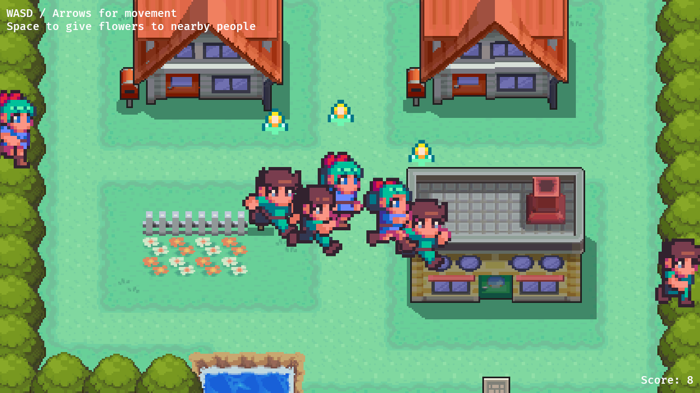

# Womans day mini game

Give flowers to the people around you. Triple the points when giving them to women!



Just made this mini game to play a bit with Rust. I has no win condition, no pause, no menus, no loading screen, no thrills :) 

## Build Wasm binary

### Nix

To build a Wasm binary from the [Rust sources](./src/main.rs):

```shell
nix build
```

This generates a [stripped] Wasm binary at `result/bin` (where `result` is a symlink to a [Nix store][store] path).

## Rust/Cargo

```shell
cargo build
```

## Run the binary

The binary will run with `wasm-server-runner`

### Nix

```shell
nix run 
```

### Cargo

```shell
cargo run 
```

Run on a completely open port to test from a remote

```shell
WASM_SERVER_RUNNER_ADDRESS=0.0.0.0 cargo run 
```
